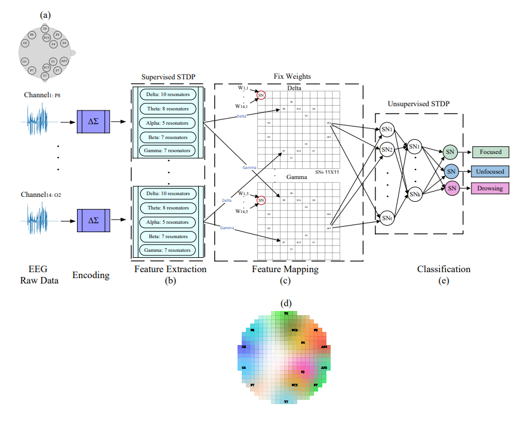

# Mental Attention Detection Using SNN



**Title:** Situational Awareness Classification Based on EEG signals
and Spiking Neural Network

**Abstract:** Situational awareness detection and characterization of mental states have a vital role in medicine and many other fields. An electroencephalogram (EEG) is one of the most effective tools for identifying and analyzing cognitive stress. Yet, the measurement, interpretation, and classification of EEG sensors is a challenging task. This study introduces a novel machine learning-based approach to assist in evaluating situational awareness detection using EEG signals and spiking neural networks (SNNs) based on a unique spike-continuous-time-neuron ([SCTN](https://github.com/NeuromorphicLabBGU/SCTN/tree/main)). The implemented biologically inspired SNN architecture is used for effective EEG feature extraction by applying time-frequency analysis techniques and allows adept detection and analysis of the various frequency components embedded in the different EEG sub-bands. The EEG signal undergoes encoding into spikes and is then fed into an SNN model which is well-suited to the serial sequence order of the EEG data. We utilize the SCTN-based resonator for EEG feature extraction in the frequency domain which demonstrates a high correlation with the classical FFT features. A new SCTN-based 2-D neural network is introduced for efficient EEG feature mapping aiming to achieve a spatial representation of each EEG sub-band. To validate and evaluate the performance of the proposed approach a common publicly available EEG dataset is used. Experimental results show that by using the extracted EEG frequencies features and the SCTN-based SNN classifier the mental state can be accurately classified with an average accuracy of 96.8\% for the common EEG dataset. Our proposed method outperforms existing machine learning-based methods and demonstrates the advantages of using SNN for situational awareness detection and mental state classifications.

**Autohrs:** Yakir Hadad, Moshe Bensimon, Shlomo Greenberg and Yehuda Ben-Shimol 


### Requirements
```bash
pip install -r requirements
```

## Dataset
The [Dataset](https://www.kaggle.com/datasets/inancigdem/eeg-data-for-mental-attention-state-detection) is a collection of 34 experiments for monitoring of attention state in human individuals using passive EEG BCI.

Each Matlab file contains the object of the data acquired from EMOTIV device during one experiment. The raw data is contained in o.data, which is array of size {number-of-samples}x25, thus o.data(:,i) comprises one data channel. The sampling frequency is 128 Hz. The list of data channels and their numerical ids is given below per EMOTIV documentation;
The EEG data is in the channels 4:17.


### Usage
1. Download the dataset from [Dataset](https://www.kaggle.com/datasets/inancigdem/eeg-data-for-mental-attention-state-detection), into datasets folder.
2. Run `signal2spikes.py` to create a "new" encoded dataset of all the signals after feature extraction with the resonators.
3. run `train.py` to train the network with the encoded data.
